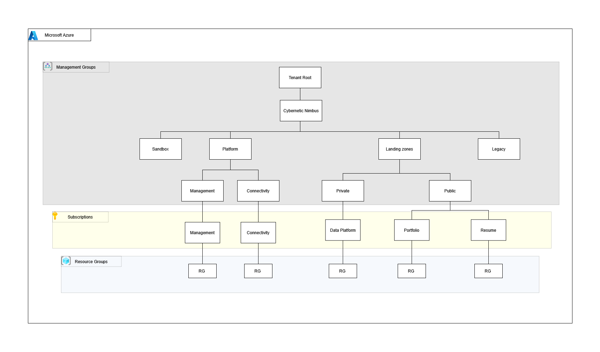

# Azure Platform 

A repository for automating a **Azure** tenant with **Terraform**.

---

## Table of Contents

- [Pre-requisites](#pre-requisites)
- [Diagrams](#diagrams)
- [Project Structure](#project-structure)
- [Resources Documentation](#resources-documentation)

---

## Pre-requisites

- Create Azure management group
- Set Subscriptions
- Azure CLI - https://learn.microsoft.com/en-us/cli/azure/install-azure-cli
- Terraform - https://developer.hashicorp.com/terraform/install


## Diagrams

### Azure organization



> **Note:** The diagrams are a **high level overview** and don't capture the **all deployed resources**.

---

## Project Structure

```
/azure_platform
|
├── /landing_zones                     # Deployable workloads and applications
│   ├── /private                       # Internal / non-public workloads
│   │   └── /data_platform             # Data platform landing zone (Databricks + dbt)
│   │       ├── /env
│   │       │   ├── dev.tfvars
│   │       │   └── prod.tfvars
│   │       ├── /notebooks             # Databricks notebooks
│   │       │   ├── dashboards.ipynb
│   │       │   └── test_connection.ipynb
│   │       ├── /query_app             # Go application for querying the data platform
│   │       │   ├── main.go
│   │       │   ├── go.mod
│   │       │   └── go.sum
│   │       ├── main.tf
│   │       ├── variables.tf
│   │       ├── outputs.tf
│   │       ├── versions.tf
│   │       └── README.md
│   └── /public                        # Publicly accessible workloads
│       ├── /cloud_resume              # Cloud resume 
│       │   └── main.tf
│       └── /portfolio                 # Portfolio site
│           └── main.tf
│
├── /modules                           # Reusable Terraform modules
│   ├── /automation                    # Azure Automation and schedules
│   │   ├── /scripts/automation
│   │   │   ├── manage-vms.ps1
│   │   │   └── manage-vmsv2.ps1
│   │   ├── main.tf
│   │   ├── variables.tf
│   │   └── outputs.tf
│   ├── /compute                       # Virtual machines and compute resources
│   │   ├── main.tf
│   │   ├── variables.tf
│   │   └── outputs.tf
│   ├── /dbt_cloud                     # dbt Cloud integration
│   │   ├── main.tf
│   │   ├── variables.tf
│   │   └── outputs.tf
│   ├── /dbx_resources                 # Databricks workspace resources (clusters, jobs, catalogs, etc.)
│   │   ├── main.tf
│   │   ├── variables.tf
│   │   └── outputs.tf
│   ├── /dbx_workspace                 # Databricks workspace with VNET injection
│   │   ├── main.tf                    # Workspace, subnets, NSGs, and NAT gateway
│   │   ├── variables.tf
│   │   └── outputs.tf
│   ├── /monitoring                    # Log Analytics, diagnostics, and alerts
│   │   ├── main.tf
│   │   ├── variables.tf
│   │   └── outputs.tf
│   ├── /network                       # VNets, subnets, NSGs, and peering
│   │   ├── main.tf
│   │   ├── variables.tf
│   │   └── outputs.tf
│   ├── /security                      # Key Vault,secrets and service principals
│   │   ├── /secrets                   # Key Vault secrets sub-module
│   │   │   ├── main.tf
│   │   │   ├── variables.tf
│   │   │   └── outputs.tf
│   │   ├── main.tf
│   │   ├── variables.tf
│   │   └── outputs.tf
│   ├── /service_principal             # Azure AD service principal management
│   │   ├── main.tf
│   │   ├── variables.tf
│   │   └── outputs.tf
│   └── /storage                       # Storage accounts and data lake containers
│       ├── /backend                   # module for creating Azure state backend
│       │   ├── main.tf
│       │   ├── variables.tf
│       │   └── outputs.tf
│       ├── main.tf
│       ├── variables.tf
│       └── outputs.tf
│
├── /platform                          # Core platform infrastructure
│   ├── /connectivity                  # Hub networking
│   └── /management                    # Management group hierarchy and platform resources
│       ├── /env
│       │   ├── dev.tfvars
│       │   ├── prod.tfvars
│       │   └── qa.tfvars
│       ├── iam.tf
│       ├── import.tf
│       ├── main.tf
│       ├── mg_groups.tf
│       ├── variables.tf
│       ├── outputs.tf
│       └── versions.tf
│
├── template.tf                        # Templates for tfvars and debug.sh files
└── README.md
```
---
## Resources Documentation
Detailed documentation for all deployed resources is available in the individual module directories
